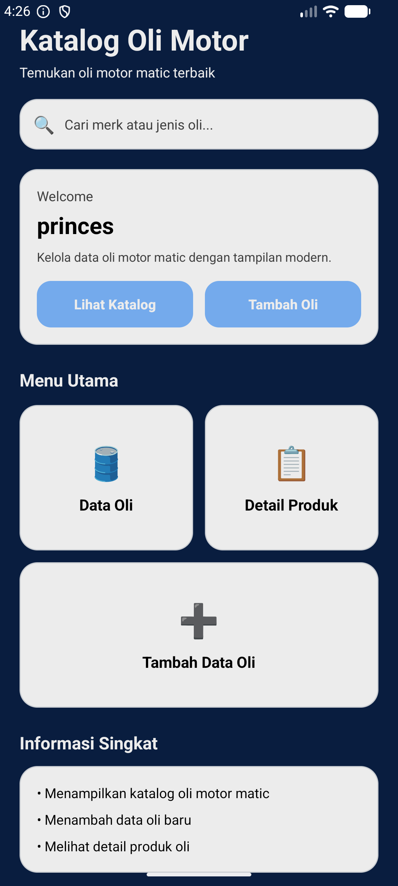
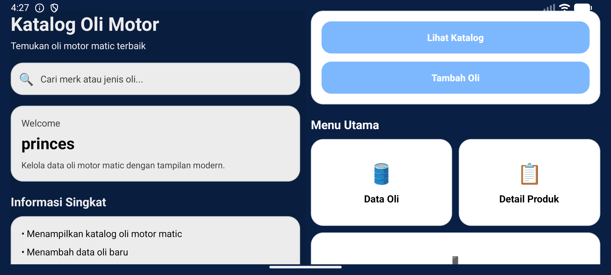
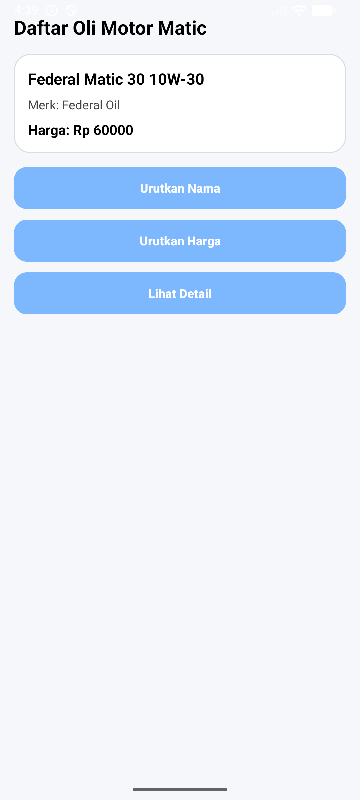
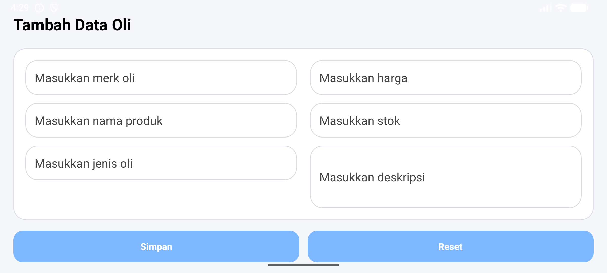
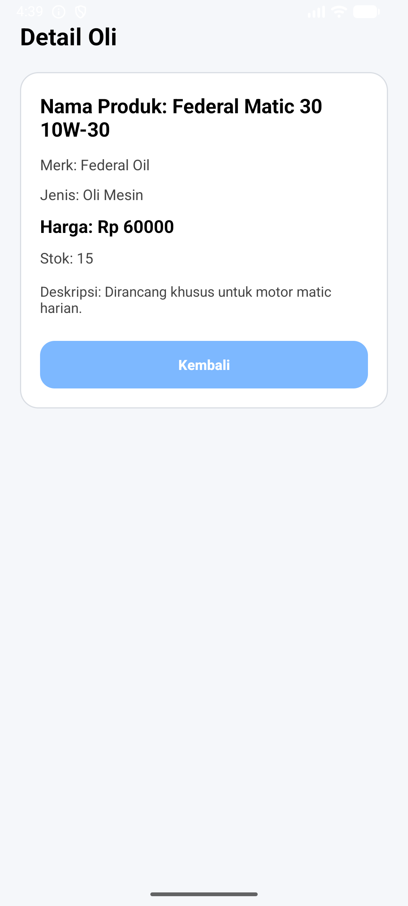
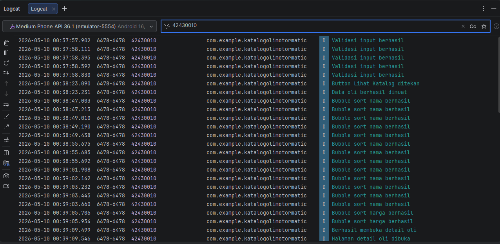

# UAS Katalog Oli Motor Matic

## Identitas Mahasiswa
• **Nama Lengkap:** Indriani Asten
• **NIM:** 42430010

## Topik Aplikasi
**Katalog Oli Motor Matic**

## Deskripsi Aplikasi
Aplikasi ini merupakan aplikasi Android sederhana yang dibuat untuk menampilkan katalog oli motor matic.
Aplikasi memiliki beberapa halaman utama seperti halaman home, halaman katalog, halaman tambah data oli, dan halaman detail oli.

Aplikasi ini juga mengimplementasikan beberapa materi pemrograman seluler, yaitu:
• Intent untuk navigasi antar halaman
• Validasi input pada form tambah data
• Array dummy untuk data oli
• Linear Search untuk pencarian data
• Bubble Sort untuk pengurutan data
• Try-Catch untuk penanganan error sederhana
• Logcat dengan NIM mahasiswa

## Fitur Aplikasi
1. **Halaman Utama**
   - Menampilkan tampilan awal aplikasi
   - Terdapat tombol navigasi ke halaman katalog dan tambah oli

2. **Halaman Katalog**
   - Menampilkan data oli motor matic
   - Menampilkan nama, merk, dan harga oli
   - Terdapat tombol detail
   - Terdapat fitur pengurutan data menggunakan Bubble Sort

3. **Halaman Tambah Data Oli**
   - Menyediakan form input data oli
   - Memiliki validasi input
   - Memiliki tombol simpan dan reset

4. **Halaman Detail Oli**
   - Menampilkan detail data oli yang dipilih dari halaman katalog

## Algoritma yang Digunakan
### 1. Linear Search
Linear Search digunakan untuk mencari data oli dari array dummy secara berurutan dari awal sampai akhir.

### 2. Bubble Sort
Bubble Sort digunakan untuk mengurutkan data oli:
• berdasarkan **nama produk**
• berdasarkan **harga**

## Struktur Halaman Aplikasi
• **MainActivity** → halaman utama
• **KatalogActivity** → halaman katalog data oli
• **TambahOliActivity** → halaman form tambah data
• **DetailOliActivity** → halaman detail oli

## Screenshot Aplikasi

### 1. Halaman Utama (Portrait)

### 2. Halaman Utama (Landscape)

### 3. Halaman Katalog

### 4. Halaman Tambah Produk (Portrait)

### 5. Halaman Tambah Produk (Landscape)

### 6. Halaman Detail Katalog

### 7. Screenshot Hasil Pencarian Data

### 8. Screenshot Hasil Pengurutan Data

### 9. Screenshot Logcat
Tambahkan screenshot Logcat Android Studio yang menampilkan NIM **42430010** di bawah ini:

## Teknologi yang Digunakan
• **Kotlin**
• **Android Studio**
• **XML Layout**
• **ArrayList**
• **Intent**
• **Logcat**

## Kesimpulan
Aplikasi Katalog Oli Motor Matic ini dibuat untuk memenuhi tugas UAS Pemrograman Seluler.
Aplikasi ini telah menerapkan berbagai materi yang dipelajari, seperti pembuatan UI portrait dan landscape, validasi input, navigasi antar halaman, penggunaan array dummy, linear search, bubble sort, try-catch, serta logcat.

## Repository GitHub
Tambahkan link repository GitHub kalian di sini:

[UAS Katalog Oli Motor Matic](https://github.com/astenindriani-jpg/UAS_KatalogOliMotorMatic)
